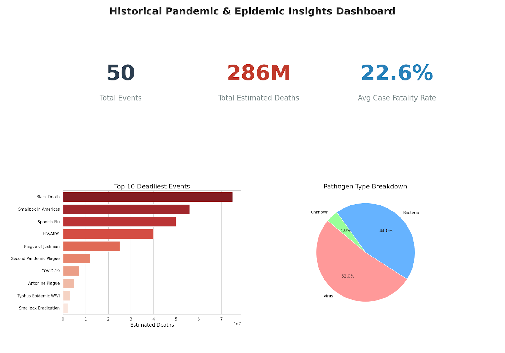
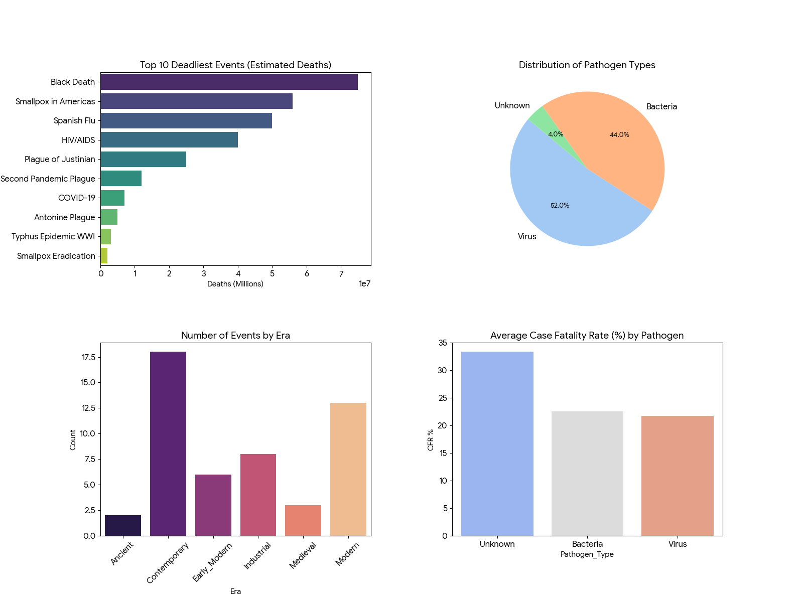

# FROM PAST TO PREENT: INSIGHTS FROM HISTORICAL PANDEMIC DATA

## INTRODUCTION

Pandemics and epidemics have significantly shaped human history, impacting populations, economies, and global development. From ancient outbreaks to modern global crises, studying historical disease patterns helps us understand how diseases spread, their severity, and how societies respond. This analysis explores historical pandemic data to identify trends, impacts, and lessons for future preparedness.

## ABOUT THE DATASET

The dataset tracks 50 unique historical events using 21 different variables, It contains records of major pandemics and epidemics across different time periods and regions. It also provides insights into the scale, duration, and impact of disease outbreaks.
Key Features:
- Disease Name: Plague, Influenza, COVID-19
- Time Period: Start and end years of outbreaks
- Location/Region: Countries or continents affected
- Death Toll: Estimated number of deaths
- Duration: Length of each outbreak
- Type of Disease: Viral, bacterial, etc.

This dataset allows for historical comparison and trend analysis of global health crises.

## PROBLEM STATEMENT 

The main objective of this analysis is to answer key questions such as: which pandemics were the most deadly in history, how have pandemics evolved over time, are pandemics becoming more or less severe, which regions have been most affected, what patterns can help predict or manage future outbreaks? 
Overall, the goal is to derive insights that support public health planning and risk management.

## VISUALIZATION

Sql and Microsoft Excel was used to analyse the dataset. The dashboard generated above highlights four critical perspectives: 
1. **Top 10 deadliest events**: A bar chart comparing the absolute scale of human loss, showing events like the Black Death and Spanish Flu.
2. **Pathogen type distribution**: A pie chart showing the proportion of viral vs. bacterial outbreaks.
3. **Number of events by era**: A chronological view of how many major outbreaks were recorded in each historical period.
4. **Average case fatality rate (%) by pathogen**: A comparison of how lethal different categories of disease typically are.

## INSIGHTS

1. Severity of Pandemics
- Certain pandemics (e.g., plague outbreaks) caused extremely high death tolls, making them the deadliest in history
- Modern pandemics tend to have lower mortality rates due to medical advancements.
2. Trends Over Time
- Earlier centuries experienced fewer but more deadly outbreaks
- Recent times show more frequent but better-controlled pandemics
3. Geographic Impact
- Some regions are repeatedly affected due to population density and trade routes
- Globalization has increased the speed of disease spread
4. Disease Type
- Viral diseases (like influenza and COVID-19) spread faster
- Bacterial diseases historically caused higher mortality due to lack of treatment
5. Duration Patterns
- Older pandemics lasted longer due to limited medical knowledge
- Modern outbreaks are often controlled faster with vaccines and interventions

## RECOMMENDATION 

1. For Governments & Health Organizations: They should invest in early detection systems and surveillance, strengthen healthcare infrastructure, and promote global collaboration for disease control.
2. For Researchers: They should focus on predictive modeling and outbreak simulation, study historical patterns to improve future response strategies.
3. For Society: They should increase awareness about hygiene, vaccination, and prevention, encourage rapid response during outbreaks.

## CONCLUSION 

The dataset serves as a sobering reminder of the cyclical nature of pandemics. While the Contemporary era has the most events, our ability to achieve "Medical Breakthroughs" (present in 40% of cases) is our strongest defense compared to the "Natural Decline" reliance of the Medieval and Ancient periods. Furthermore, while diseases remain a major global threat, advancements in medicine and technology have significantly reduced their impact. However, increased global connectivity poses new risks for rapid spread.
Therefore, understanding past pandemics provides valuable lessons for improving preparedness, minimizing damage, and ensuring a more resilient response to future global health crises.

